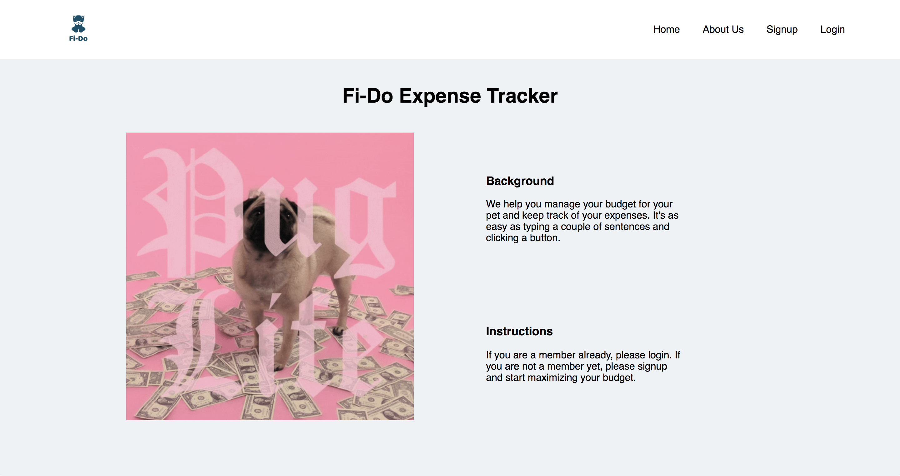
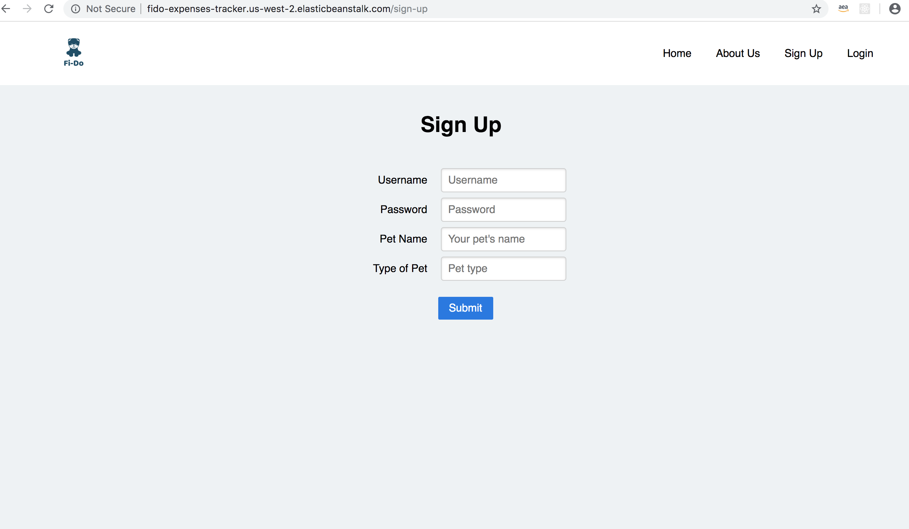
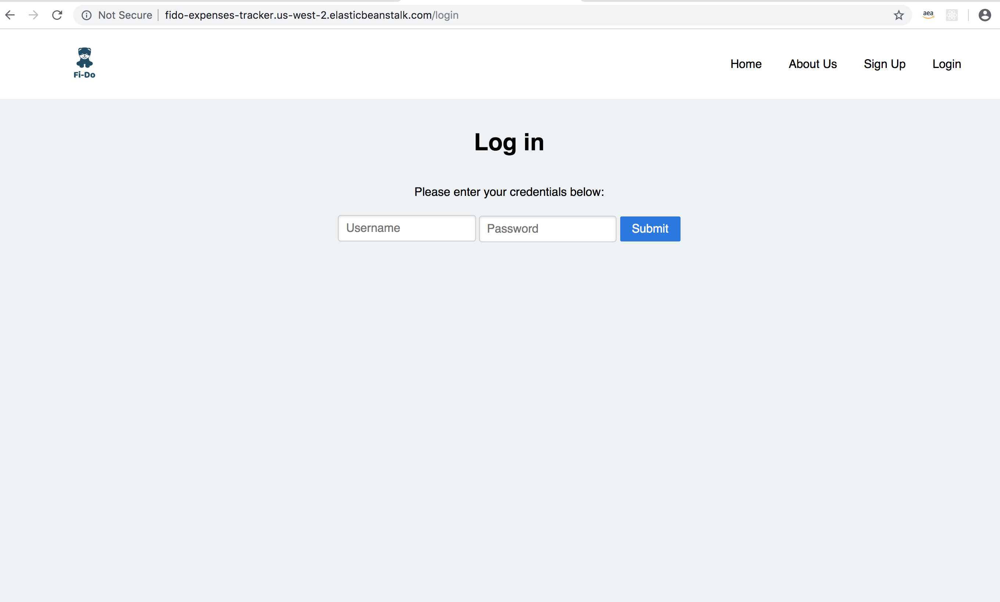
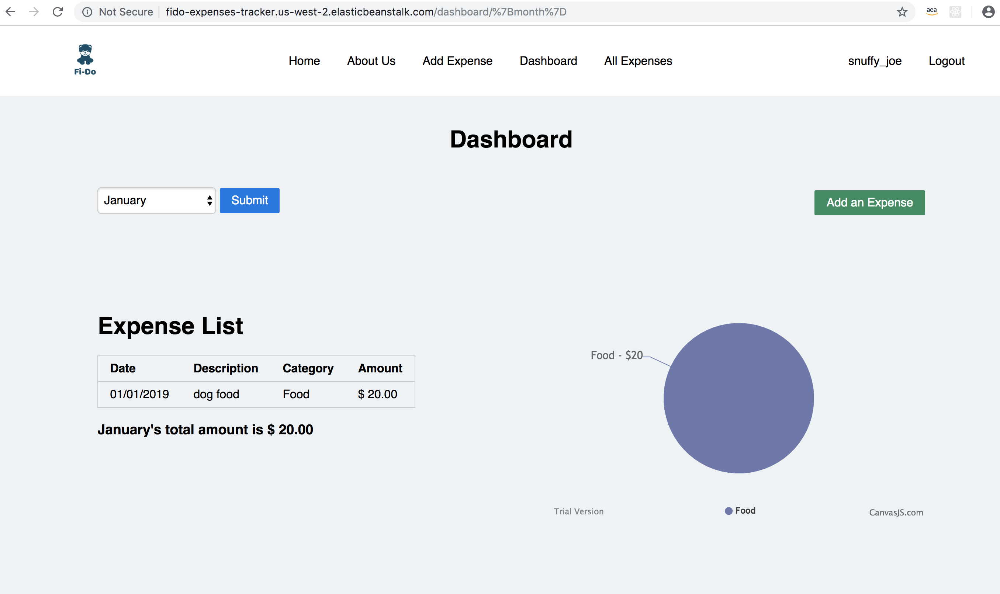
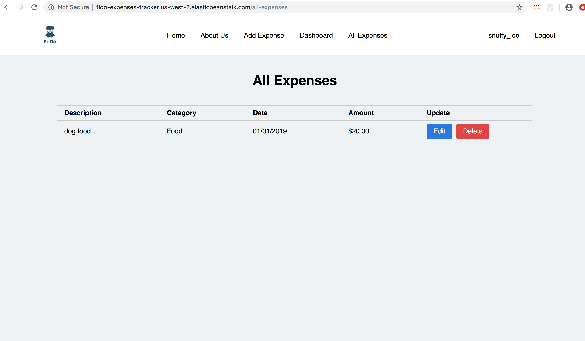

# Fi-Do Expense Tracker

## Author
* Liz Mahoney - [emd5](https://github.com/emd5)
* Levi Porter - [levibrooke](https://github.com/levibrooke)
* Sudip Adhikari - [sadhikari07](https://github.com/sadhikari07)
* Kishor Pandey - [kishorpan2](https://github.com/kishorpan2)

## Version 
1.0.0

## Overview
A pet expense tracker app that keeps track of month-to-month expenses. Features include:
* Ability to sign-up
* Ability to Login using username and password
* Consists of category expense breakdown
* Ability to create expense and see all expenses in the dashboard
* The dashboard page will also show monthly expenses by category, total amount by category and the total expenses.

## Links 
Deployed Link - <http://fido-expenses-tracker.us-west-2.elasticbeanstalk.com/>

## Getting Started

- Clone this repo `git clone https://github.com/team-char/pet-expenses-tracker.git`.
- Open the directory with intelliJ `idea .`
- In the import project popup screen, select `use import`, and select appropriate JDK (can be 8 or above).
- Create a Postgresql database named `fido`
- Go to `src` > `main` > `resources` > `application.properties`
- To run locally, make sure the env is set to: `spring.profiles.active=dev`
- Before first run, change `application-dev.properties` change `spring.jpa.hibernate.ddl-auto=update` to `spring.jpa.hibernate.ddl-auto=create`
- Then run application to build the database tables.
- After first run, change `spring.jpa.hibernate.ddl-auto=create` to `spring.jpa.hibernate.ddl-auto=update`

***To Run Application***

In terminal run: `./gradlew bootrun`

***To view gradle commands***

In terminal run: `./gradlew tasks`

***To Run Test***

In terminal run: `./gradlew test`

## Setup

Use the Spring `Initializr` to set 
    up an app with dependencies on Web, Thymeleaf, JPA, Postgres, and Security (and optionally DevTools for auto refresh
    of app on building). Remember to do your initial commit on the master branch before creating your feature branch.
    Also, see the below note about configuring Spring Security.

## Routes

* This route will take user to the sign-up page
`/sign-up`

* This route will take user to the login page
    `/login`
    
* This route will take user to the sign-out page
    `sign-out`
* This route will take user to create expense
    `/add-expense`
    
* This route will take user to the dashboard
    `/dashboard`
    
* This route will take user where all the expenses are listed.
    `/all-expenses`
    
* This route will take user to the authors.
    `/about-us`
    
* This route will take user to the splash page
    `/`
    

## Technologies used in this application:
* Intellij
* Gradle
* Spring Boot
* Postgresql
* Github
* Chart.js
* AWS (RDS and Elastic Beanstalk)

## Resources 
    - Sprint Auth Cheat Sheet -> https://github.com/codefellows/seattle-java-401d4/blob/master/SpringAuthCheatSheet.md 
    - Hiberate Many-to-Many -> https://www.baeldung.com/hibernate-many-to-many
    - RDS Cheat Sheet - https://github.com/codefellows/seattle-java-401d4/blob/master/RDSCheatSheet.md
    - Currency format -> http://www.captaindebug.com/2011/08/using-spring-3-numberformat-annotation.html#.XRF7upNKgsk
    - Generate an empty table the populate DB -> https://www.baeldung.com/spring-boot-data-sql-and-schema-sql
    - Css -> https://purecss.io/
    - Charts -> https://canvasjs.com/docs/charts/basics-of-creating-html5-chart/
    - Integration tests for our Spring Boot Rest APIs -> https://www.javaguides.net/2018/09/spring-boot-2-rest-apis-integration-testing.html
    - How to register your event listener and create a database seeder in Spring Boot-> https://dzone.com/articles/how-to-create-a-database-seeder-in-spring-boot
    - Logo -> https://www.freelogodesign.org/?v=direct&sv=ni&utm_expid=.zKm1QJTySpqlGxV9Kiu8cQ.2&utm_referrer=https%3A%2F%2Fwww.freelogodesign.org%2F%3Fv%3Ddirect%26sv%3Dni
     